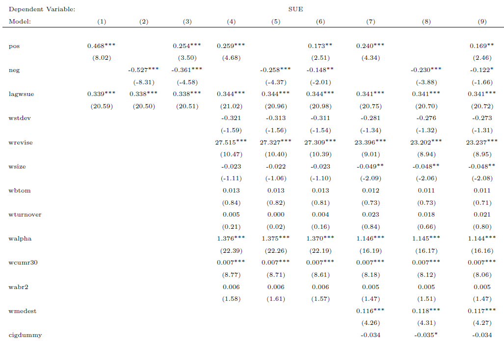

[](http://quantlet.de/index.php?p=info)

## [](http://quantlet.de/) **SUEtable** [](http://quantlet.de/d3/ia)


```yaml
Name of QuantLet:  'SUEtable'

Published in:      

Description:       'Generate regression table to see news tone effects on analyst forecast behavior'

Keywords:          'Media News, Analyst, Information, Tone'

See also:          'Accuracytable SUEdata Accuracydata'

Author:            'Guo Li'

Submitted:         'Mon, September 5 2016 by Guo Li'

Datafile:          'sue.dta'

Input:  

Output:  

Example:           
```





```Stata
cd C:\Users\~
use sue.dta

xi:areg  wsue pos lagwsue  i.lagfyear, a(cusip) cluster(cusip)
est store m1
xi:areg  wsue neg lagwsue  i.lagfyear, a(cusip) cluster(cusip)
est store m2
xi:areg  wsue pos neg lagwsue  i.lagfyear, a(cusip) cluster(cusip)
est store m3

xi:areg  wsue pos lagwsue  wstdev wrevise wsize wbtom wturnover  walpha wcumr30 wabr2 i.lagfyear, a(cusip) cluster(cusip)
est store m4
xi:areg  wsue neg lagwsue  wstdev wrevise wsize wbtom wturnover  walpha wcumr30 wabr2  i.lagfyear, a(cusip) cluster(cusip)
est store m5
xi:areg  wsue pos neg lagwsue  wstdev wrevise wsize wbtom wturnover  walpha wcumr30 wabr2 i.lagfyear, a(cusip) cluster(cusip)
est store m6

xi:areg  wsue pos  lagwsue  wstdev wrevise wsize wbtom wturnover  walpha wcumr30 wabr2 wmedest  cigdummy lnum wvolatility wmktret winstown_perc wleverage wmomentumf williquidityf wovercon1 wdiscon1 hardinfo i.lagfyear, a(cusip) cluster(cusip)
est store m7
xi:areg  wsue neg  lagwsue  wstdev wrevise wsize wbtom wturnover  walpha wcumr30 wabr2 wmedest  cigdummy lnum wvolatility wmktret winstown_perc wleverage wmomentumf williquidityf wovercon1 wdiscon1 hardinfo i.lagfyear, a(cusip) cluster(cusip)
est store m8
xi:areg  wsue pos neg  lagwsue  wstdev wrevise wsize wbtom wturnover  walpha wcumr30 wabr2 wmedest  cigdummy lnum wvolatility wmktret winstown_perc wleverage wmomentumf williquidityf wovercon1 wdiscon1 hardinfo i.lagfyear, a(cusip) cluster(cusip)
est store m9
esttab m1 m2 m3 m4 m5 m6 m7 m8 m9 using suegithub.tex, nogaps replace t b(3)  ar2 star (*  0.10  ** 0.05   *** 0.01)


```
